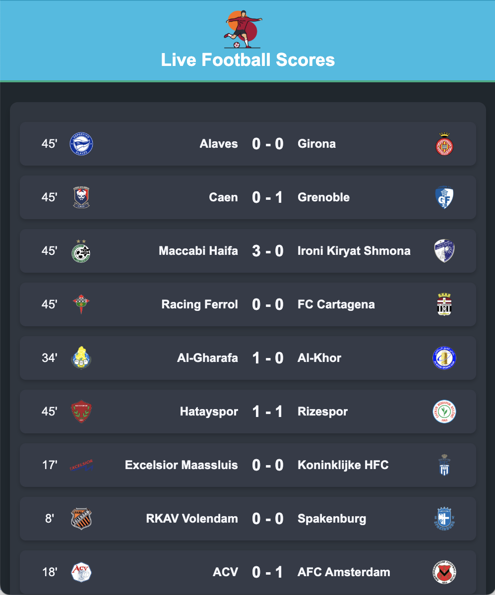

# Football Scores Extension



This is a Chrome extension that displays live football scores using the API-FOOTBALL service.

## Features

- Displays live football matches and scores.
- Shows team logos and match times.
- Updates scores in real-time.

## Installation

1. Clone the repository or download the source code.
2. Open Chrome and navigate to `chrome://extensions/`.
3. Enable "Developer mode" by toggling the switch in the top right corner.
4. Click on "Load unpacked" and select the directory containing the extension files.

## API

This extension uses the [API-FOOTBALL](https://www.api-football.com/) to fetch live match data.

Sign in get your `API_KEY` and add in the code.

```
const API_KEY = "";
```
## Usage

1. Click on the extension icon in the Chrome toolbar.
2. The popup will display live football scores.

## License

This project is licensed under the MIT License.
